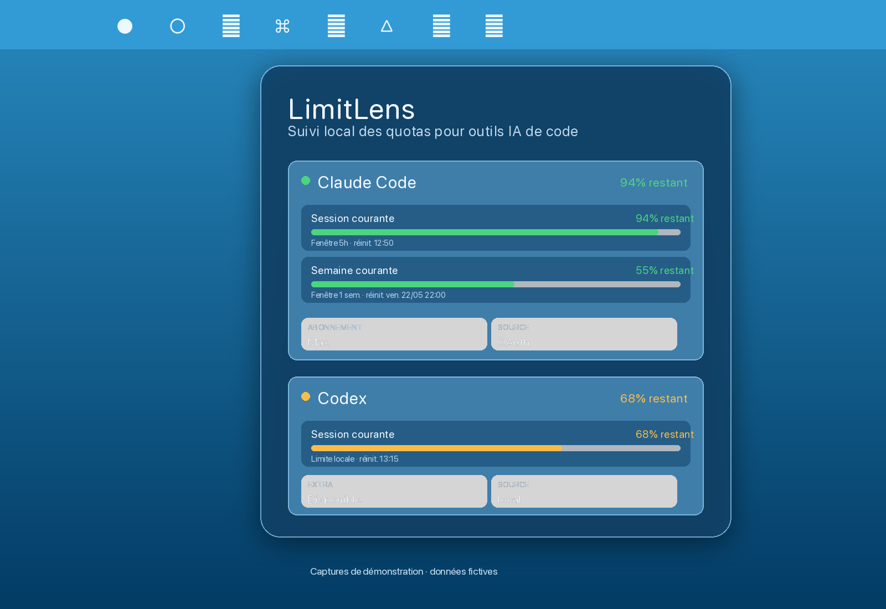
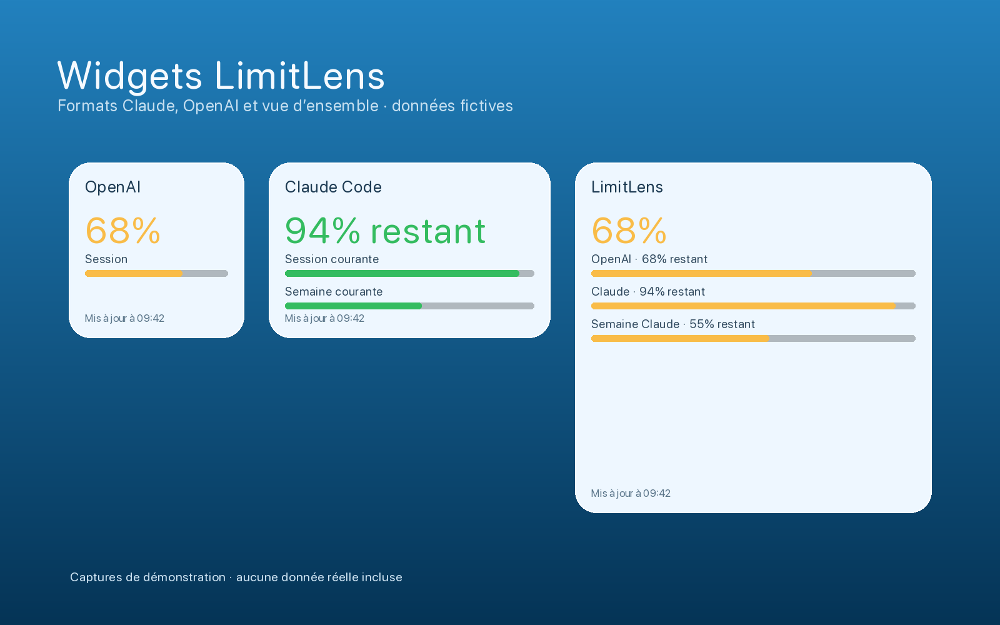

# LimitLens

LimitLens est une application macOS locale pour suivre rapidement les quotas de vos outils IA de code : OpenAI Codex et Claude Code.

Elle vit dans la barre de menus, fournit des widgets macOS, fonctionne en sandbox, et ne dépend d'aucun serveur LimitLens.



> Captures de démonstration avec données fictives. Aucune donnée de compte réelle n'est incluse dans le dépôt.

## Pourquoi

Quand on utilise Codex et Claude Code toute la journée, le vrai besoin est simple : voir ce qu'il reste sans ouvrir plusieurs interfaces, sans exposer ses clés, et sans perdre les widgets macOS.

LimitLens affiche l'état utile au bon endroit :

- dans la barre de menus, avec un pourcentage restant lisible en permanence ;
- dans une fenêtre popover compacte pour les détails ;
- dans des widgets macOS petits, moyens et grands ;
- en mode OpenAI seul, Claude seul, ou les deux.

## Fonctionnalités

- Suivi local OpenAI Codex depuis les événements de quota présents dans les sessions Codex.
- Suivi Claude Code avec estimation locale et import optionnel du jeton OAuth Claude Code pour l'usage exact.
- Widgets séparés pour OpenAI et Claude, plus une vue combinée.
- Dates et heures de renouvellement des fenêtres de quota.
- Rafraîchissement configurable.
- Application sandboxée avec accès dossier explicite via macOS.
- Interface localisée en français, anglais et espagnol.



## Confidentialité

LimitLens est conçu pour rester local-first.

- Aucun serveur LimitLens.
- Aucune télémétrie.
- Aucun prompt, log brut, chemin utilisateur ou fichier de session brut dans les widgets.
- Les secrets restent dans le trousseau macOS.
- Les widgets lisent uniquement un instantané local nettoyé, prêt à l'affichage.

OpenAI Codex ne demande pas de clé API OpenAI dans le périmètre actuel : LimitLens lit les événements locaux que Codex écrit déjà sur votre Mac.

Claude Code peut fonctionner en estimation locale. L'usage exact est optionnel : si vous choisissez "Importer depuis Claude Code", LimitLens lit le jeton OAuth Claude Code déjà présent dans le trousseau macOS, en stocke une copie dans son propre item Keychain, puis l'utilise uniquement pour interroger le endpoint d'usage Claude Code.

Le détail du modèle de sécurité est dans [SECURITY.md](SECURITY.md). L'audit de publication est dans [docs/security-audit-2026-05-20.md](docs/security-audit-2026-05-20.md).

## Installation

La version compilée est fournie depuis les releases GitHub :

[Télécharger la dernière version](https://github.com/elkir0/LimitLens/releases/latest)

Après installation :

1. Ouvrez LimitLens une première fois.
2. Choisissez les fournisseurs à activer.
3. Autorisez les dossiers Codex et/ou Claude Code quand macOS le demande.
4. Ajoutez les widgets depuis le sélecteur de widgets macOS.

Si macOS bloque un build non notarié, ouvrez l'application avec clic droit puis "Ouvrir", ou compilez depuis les sources. Les releases notarizées seront indiquées explicitement quand un certificat Developer ID est disponible.

## Compilation

Prérequis :

- macOS 14 ou plus récent ;
- Xcode ;
- XcodeGen.

Build local :

```bash
DEVELOPMENT_TEAM=YOURTEAMID ./Scripts/build-app.sh
```

Installation locale pour tester app + widgets :

```bash
./Scripts/install-app.sh
```

Archive de distribution :

```bash
./Scripts/archive-app.sh
```

Notarisation, si le profil Apple est configuré :

```bash
./Scripts/notarize-app.sh dist/LimitLens.zip
```

Le script de notarisation utilise par défaut un profil `notarytool` nommé `LimitLens`, ou la valeur de `NOTARYTOOL_PROFILE`.

## Widgets

LimitLens embarque plusieurs widgets WidgetKit :

- petit OpenAI ;
- petit Claude Code ;
- moyen OpenAI ;
- moyen Claude Code ;
- grand OpenAI ;
- grand Claude Code ;
- grand aperçu combiné.

Si un ancien widget reste visible après une mise à jour locale, retirez-le du bureau, relancez `./Scripts/install-app.sh`, puis ajoutez-le à nouveau.

## Publication

Le dépôt public exclut les artefacts de build, archives, profils de signature, fichiers `.env`, clés privées, projet Xcode généré et notes internes de travail.

Avant chaque release, refaire au minimum :

```bash
swift test
python3 Scripts/make-readme-assets.py
git ls-files
```

Puis vérifier que l'archive publiée ne contient que `LimitLens.app`.

## Licence

LimitLens est distribué sous licence MIT.
